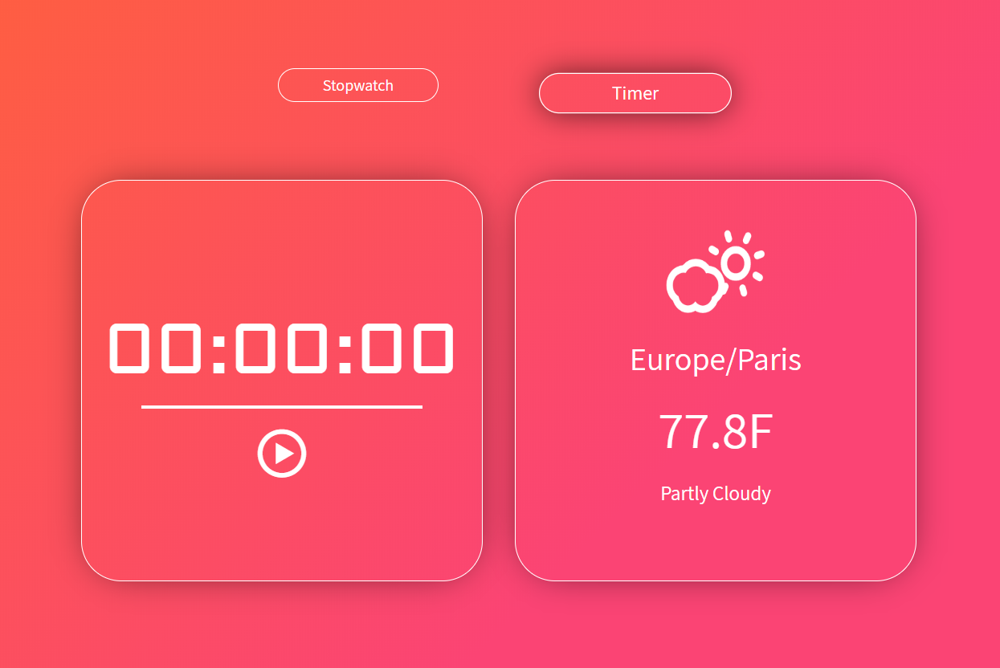

# timerStopwatchWeather-react  

"Timer-Stopwatch-Weather" application made with React. The user can switch timer / stopwatch mode and use them in everyday life (training, learning, pomadoro ...)

### [Demo on Heroku](https://) :point_left:

- React
- JSX
- HTML
- CSS
- Adaptive Web Design
- Dark Sky API



### Getting Started
Run the app:
```
> npm install
> npm start
```